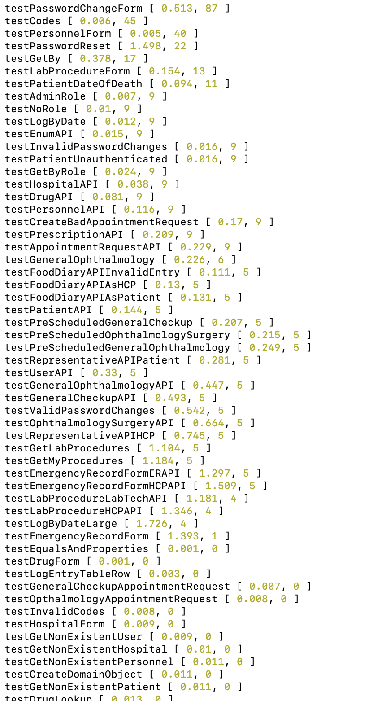
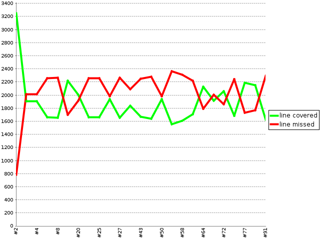
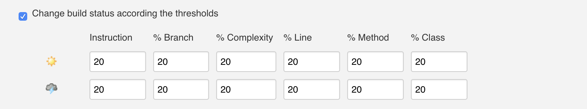
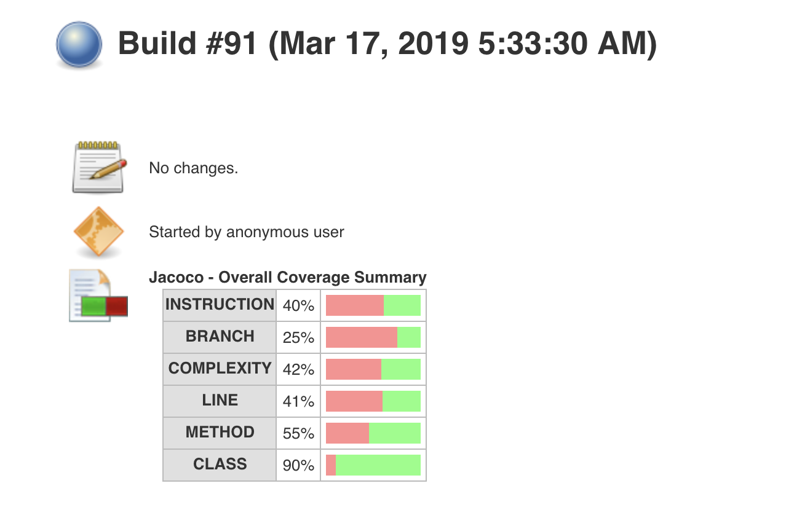
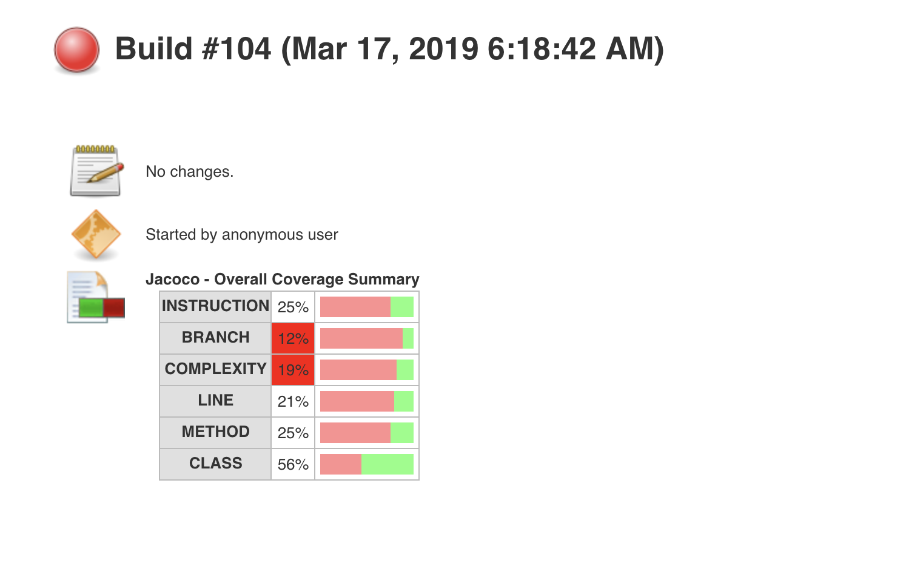
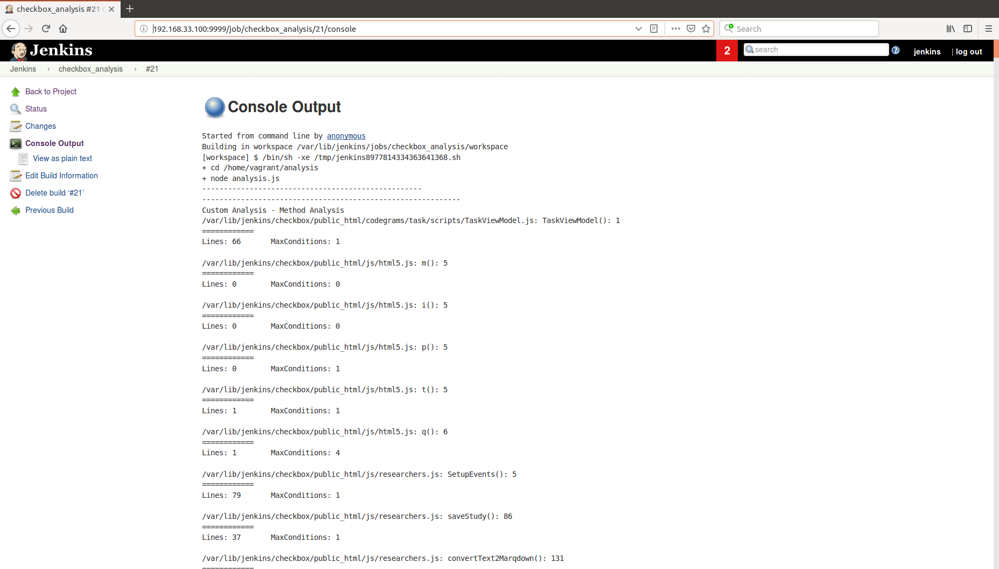

# Setting up kubernetes for testing

--> Install Minikube/Minishift
--> run minikube start
--> go to the directory that has deployment.yaml
--> kubectl create -f deployment.yaml
--> kubectl create -f service.yaml
--> curl http://minikube:80

# DevOps-Project-Milestone 2

This is the submission by Team 5 of CSC 519 - DevOps class of Spring 2019 for the Milestone 2 of DevOps Project. The contributors in alphabetic order are:

Karthik Medidisiva  -   kmedidi

Kshittiz Kumar      -   kkumar4

Shivam Chamoli      -   schamoli

Vidhisha Jaswani    -   vjaswan

## Introduction
Use milestone_2 branch for this submission
In this milestone the following objectives were tackled.

 Techniques related to fuzzing, test case priorization, and static analysis to improve the quality of checkbox.io and iTrust.

## Roles & their Description

1. Ansible: Installs Ansible on Jenkins VM.
2. Maven: Installs Maven on Jenkins VM.
3. Java: Installs Java 8 on Jenkins VM.
4. MySQL: Install MySQL and edits root password on Jenkins VM.
5. Deployfiles: Copies all files to Jenkins VM required for building the applications.
6. Jenkins: Automatically installs Jenkins on ```http://<ip_address_of_jenkins_srv>:<jenkins_port>/``` along with bypassing the user account setup and installing plugins.
7. Jobs: Creates and triggers build for checkbox.io and iTrust applications.
8. jFuzzer: Java code to read all java files and fuzz the code with some probability. It resets the head after each commit so that each time we fuzz, we fuzz the base code.
9. Final-Test-Prioritization: NodeJS code to prioritize tests.
10. Analysis: Custom Analysis for Checkbox

## Workflow

1. We setup our Server by installing all dependencies such as Maven, Ansible, MySQL, Java first. We copy all our required files onto this server using the deployfiles role.
2. Jenkins is then installed on this server. We have used port 9999 for Jenkins since iTrust runs on 8080. You may access Jenkins on 192.168.33.100:9999 and login using username ```jenkins``` and password ```jenkins```. You may change these values in variables.yml.
3. After Jenkins is setup, Jobs for checkbox.io, iTrust Fuzzer, and iTrust are created. The iTrust Fuzzer job runs the command ```cd /home/vagrant/jFuzzer && sudo mvn assembly:assembly -DdescriptorId=jar-with-dependencies && sudo java -cp target/jFuzzer-0.0.1-SNAPSHOT-jar-with-dependencies.jar edu.ncsu.fuzzer.Application  ``` which runs the fuzzer code. The fuzzer code fuzzes the code with some probability, commits the code, and after a designated sleep time resets the head so that the next time we fuzz, we do it on the stable code. As soon as the commit is made from the Java code, a [file](hooks/post-commit) is invoked which is kept inside ```iTrust2-v4/iTrust2/.git/hooks```. We copy this hook automatically using deployfiles role. This hook in turn calls ```ansible-playbook /home/vagrant/job_rebuilds/rebuild_itrust_job.yml``` builds the iTrust job. 
4. When the iTrust Job is build we run the following steps:
   - ```ansible-playbook /var/lib/jenkins/deploy_itrust_fuzzer.yml``` . This ansible playbook does all things neccessary for iTrust deployment such as copying email.properties and db.properties.
   - Inside this playbook we call a nodeJS code that in turn calls the ```mvn clean install && mvn test``` commands.
   - After this, in build shell we call the ``` mvn checkstyle:checkstyle``` command to generate checkstyle reports.
5. You can alter the number of commits in [file](ansible-srv/roles/jFuzzer/src/main/java/edu/ncsu/fuzzer/ItrustFuzzing.java) on line 24 for variable COMMITS.
6. We have also set a threshold for our iTrust job that if code coverage (Instructions, % Branch, % Complexity, % Line, % Method, % Class) is above 25%, our job always passes and if it is below 25% our job always fails. So when the iTrust Job is built, it may pass or fail according to this threshold.
7. After the build is complete, you can see the Jacoco reports from the UI itself regardless if the build fails or passes.


## About the Fuzzer
For this milestone, we designed a tool called jFuzzer (maven project) using [JavaParser](http://javaparser.org/) API and [JGit](https://git-scm.com/book/uz/v2/Appendix-B%3A-Embedding-Git-in-your-Applications-JGit). JavaParser APIs allows us to parse java source code and build Abstract Syntax Tree (AST) which further can be used to do fuzzing.

**Fuzzing operations performed using jFuzzer**
- change string constant (50% probability)
  - introduce a new string constant called 'FUZZY' with probablity of 20%
  - introduce a new string constant called 'MORE_FUZZY' with probablity of 30%
- swap true with false values and vice versa (probability 50%)
- swap binary-relational operators (probability 70%)
  - swap "<" with ">" (not > with < to avoid lambda expressions errors)
  - swap "*" (multiply) with "/" (divide)
  - swap "|" (binary AND) with "&" (binary OR) and vice versa
- swap "==" with "!=" and vice versa (probablity 30%)
- swap "+=" with "=" (probability 30%)

**How does JGit helps?** JGit allows java program to execture git commands. In jFuzzer a new fuzzer branch is created if not present using JGit. Further it commits the code after fuzzing is done on the source files and reset it at the end. This is done till 100 commits are made. *For fail-safe a final reset is done to the original commit of iTrust*.

**Future scope:** jFuzzer designed for this milestone consider the most basic parameters for fuzzing. However there are lot of other ways a fuzzing can be done including:
  - Fuzzing on lambda expressions
  - Fuzzing on arrays creation & initialization
  - Fuzzing on method call expressions
  - Fuzzing on Fields access expressions
  - Fuzzing on switch cases expressions

## Test Prioritization
1. Test Prioritization is automated at the end of 100 commits of the fuzzed code. It is in the following format: Name of the testcase [maximumRuntime failedCount].
2. maximumRuntime is the maximum time that the test case took to run out of those 100 builds. failedCount is the number of times the test case failed out of 100 builds, subsequently the test case passed (100-failedCount) number of times.
3. Our Test Prioritization sorts based on number of times the test case failed and then on the maximumRuntime.
4. We run per build analysis of the test cases which is logged on the jenkins build and then we finally parse all the log files to perform the prioritization.

 #### Test Prioritization result analysis
 1. We performed the analysis based on the logs of the jenkins builds and prioritized based on the number of times the same test case failed over the 100 builds and then over maximumRuntime of the test case.
 2. We faced several issues, firstly we needed persistent data to consolidate the report and we resolved that by researching more about jenkins builds and then using the log data. Secondly, we faced many issues while parsing and reading those log files and learnt a lot about the intricacies of the synchronous and asynchronous code.
 3. According to our results the test cases should be run in the same order as in the image 
 4. From the above results we see that the test cases that failed most number of times failed because of change in string contanst (due to fuzzed code) such as testPasswordChangeForm, testCode etc. Furthermore, we also came to the conclusion that the test cases that never failed used the setter and getter methods on the same parameters i.e. the test case wrote over the fuzzed code and checked the value set by itself (testDrugForm, testHospitalForm).
 5. Our jFuzzer (fuzzing tool) did not alter any coding conventions/styles and hence we did not notice any change in the checkstyle.html for all builds.
 6. The build log files for our 100 builds are kept at [buildlogs](https://drive.google.com/file/d/1-5pwvNnrQk8XfeqplocAdBLwf0CNYFNr/view?usp=sharing)

The testcase prioritization results over the 100 builds are available [here](results/test-prioritization-result.txt).

## Custom Analysis for Checkbox
To achieve this objective, the code ```analysis.js``` is used. We use the open-source tool [esprima](http://esprima.org/index.html), to parse the source code of Checkbox into an AST. We then process the derived AST to check if the code meets the desired thresholds. These thresholds are specified in the ```variables.yml``` file under the Analysis section. When these thresholds aren't met, the build has been failed. The techniques that have been used to perform the analysis are as follows:
1. Max Lines in a function
2. Max Conditions
3. Duplicate or structurally similar code (Warning not Build Failure): Two methods are specified. If the ```jsinspect``` method is specified, then the [jsinspect](https://www.npmjs.com/package/jsinspect) tool is used to detect code similarity. On the other hand, if the ```internal``` method is specified, then a self-developed algorithm is used to detect similarity between functions.
4. Detection of security token: Keyword search is performed on the files in the sepcified directory

The default recommended values are specified in [variables.yml](variables.yml).

## Instructions for execution
Follow the below instructions.

### Initial Steps

1. Git clone the master branch and set up the ansible-srv and jenkins-srv using baker bake.

2. The inventory file has the details for jenkins-srv VM. You may edit the IP address if necessary. It is assumed that the jenkins-srv runs as the host for source repository that tracks the changes made to the Enterprise applications ```checkbox.io``` and ```iTrust2```.

3. Set up the interactions between local repo and this source repo. The following instructions achieve the same. 

   - On the jenkins-srv VM, create the production git repositories ```checkbox.git``` and ```itrust.git```.

   - Inside the ```*.git``` directories, run the following command to initialize as a bare repository.
<br>```$ git init --bare```

   - At the host machine (which is able to SSH into the jenkins-srv without the need to specify password or identity file (Steps are 1. Generate the key-pair; 2. Add the public key on jenkins-srv ~/.ssh/authorized_keys; 3. Inside the host-machine, add the IdentityFile pointing to private key in ~/.ssh/config), clone the checkbox.io and iTrust applications from the online github repositories ([checkbox.io](https://github.com/ShivamChamoli/checkbox.io) and [iTrust](https://github.ncsu.edu/engr-csc326-staff/iTrust2-v4)). This includes creating a ssh-key pair, adding this public key in the ~/.ssh/authorized-keys of jenkins-srv and on github and keeping the private keys inside ~/.ssh of host machine. In case it gives permission denied error, also run ```ssh-agent -s``` and ``` ssh-add ~/.ssh/<private_key_name>``` on local host machine.

   - Now navigate inside this repo and add the bare repositories created inside jenkins-srv as a remote repo called       ```prod```.
    <br>```$ git remote add prod vagrant@<IP of jenkins-srv>:/~/<bare_repo>```

   - For example,
     <br>```$ git remote add prod vagrant@192.168.33.100:/~/checkbox.git```

   - Inside post-receive of itrust.git/hooks and checkbox.git add content
     ```
     #!/bin/sh
     GIT_WORK_TREE=/home/vagrant/ git checkout -f                                              
     ```
   - Also, give permission using ```chmod +x post-receive```

   - Create an initial push into this bare repo from the local repo
   <br>```$ git push prod master```

   - NOTE: You may edit this [file](variables.yml) if you have the remote repo at a different location.


### Setting up Jenkins, Fuzz the code to create 100 commits, Run build jobs for iTrust

1. Execute the the command ```ansible-playbook -i inventory playbook.yml```. This will install all dependencies such as maven, ansible, mysql, and jenkins. It will then create the iTrust fuzzer job which in turn invokes the build of the iTrust job.
   NOTE:
   The variables need to be set in variables.yml. Do NOT set to 8080 as this port is used by  iTrust. We have used port 9999. With our dummy values, a new user with the credentials as follows is created. username: ```jenkins``` password: ```jenkins```. You may change these credentials in variables.yml for this role.

2. Check the installation and build by logging into ```http://<ip_address_of_jenkins_srv>:<jenkins_port>/```, in our case 192.168.33.100:9999. You must be able to see the log in page of Jenkins.
3. After the build is complete, you can see the Jacoco reports from the UI itself regardless if the build fails or passes.


## Results

The coverage trend for 100 builds is as below:



The thresholds we have set for the job to pass or fail based on code coverage



Example of a job build that passes based on code coverage threshold.


Example of a job build that fails based on code coverage threshold.


Example of checkbox custom analysis build log



## Contribution
1. **Karthik Medidisiva** : Custom Analysis of Checkbox and Contribution to Test Case Prioritization.

2. **Kshittiz Kumar**: Created jFuzzer tool using JavaParser and JGit APIs. Contributed to jenkins build management. Managed Git branches.

3. **Shivam Chamoli**: Tests Prioritization Analysis, Created the required jobs using jenkins-jobs-builder, Did the research for succesfully getting the coverage reports using JaCoCo and the the static analysis reports using checkstyle, contributions to architectural design and contributions to building the final builds and report

4. **Vidhisha Jaswani**: Worked on setting up the constraints/variables. Worked on the fuzzer code. Managed ansible playbooks, integrations, and testing. Ran 100 builds for the iTrust job. Made the screencast and also contributed in readme.
 
## Screencast
[Screencast Link](https://youtu.be/xwh4ocSP8po)

**Thank you!**
