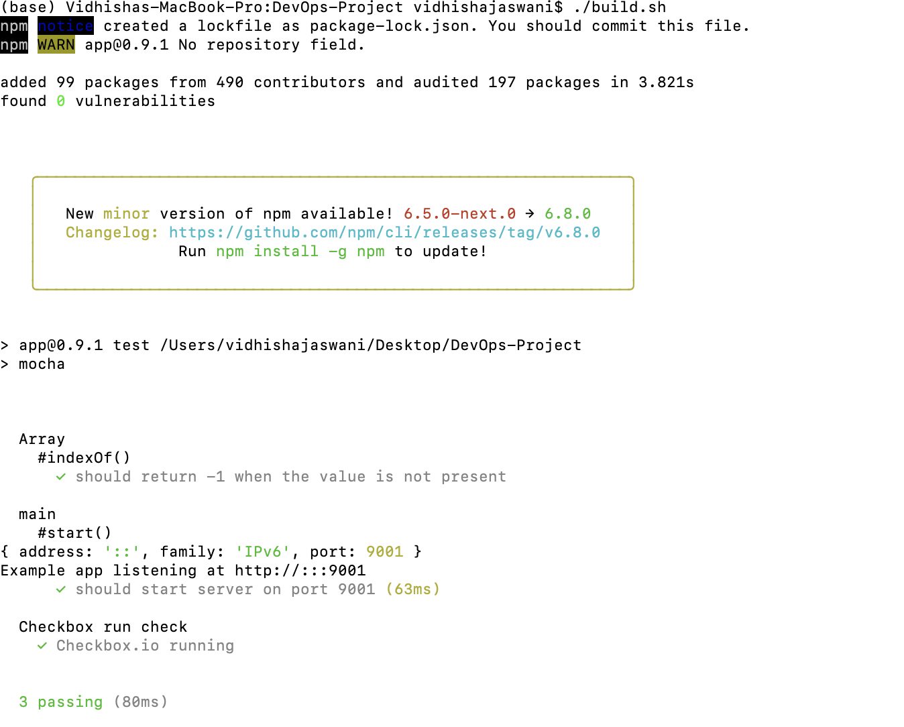

# DevOps-Project-Milestone 1

This is the submission by Team 5 of CSC 519 - DevOps class of Spring 2019 for the Milestone 1 of DevOps Project. The contributors in alphabetic order are:

Karthik Medidisiva  -   kmedidi

Kshittiz Kumar      -   kkumar4

Shivam Chamoli      -   schamoli

Vidhisha Jaswani    -   vjaswan

## Introduction
In this milestone the following objectives were tackled.

1. Automatic installation of Jenkins on a remote VM
2. Automatic creation of jobs for the following applications on Jenkins:
    - checkbox.io
    - iTrust
3. Automatic triggering on builds for the jobs upon commit to the respective application's repository. These builds run tests and deploy the applications on the aforementioned remote VM
4. Using a combination of mocha/pm2, created a test script that will start and stop the express server and hit an endpoint of checkbox.io service to check its status. 

## Roles & their Description

1. Ansible: Installs Ansible on Jenkins VM.
2. Maven: Installs Maven on Jenkins VM.
3. Java: Installs Java 8 on Jenkins VM.
4. MySQL: Install MySQL and edits root password on Jenkins VM.
5. Deployfiles: Copies all files to Jenkins VM required for building the applications.
6. Jenkins: Automatically installs Jenkins on ```http://<ip_address_of_jenkins_srv>:<jenkins_port>/``` along with bypassing the user account setup and installing plugins.
7. Jobs: Creates and triggers build for checkbox.io and iTrust applications.


## Instructions for execution
Follow the below instructions.

## Initial Steps

1. Git clone the milestone_1.2 branch and set up the ansible-srv and jenkins-srv using baker bake.

2. The inventory file has the details for jenkins-srv VM. You may edit the IP address if necessary. It is assumed that the jenkins-srv runs as the host for source repository that tracks the changes made to the Enterprise applications ```checkbox.io``` and ```iTrust2```.

3. Set up the interactions between local repo and this source repo. The following instructions achieve the same. You may diverge from this set up at your own risk.

### Instructions for creating the interactions between Git repositories
3.1. On the jenkins-srv VM, create the production git repositories ```checkbox.git``` and ```itrust.git```.

3.2. Inside the ```*.git``` directories, run the following command to initialize as a bare repository.
<br>```$ git init --bare```

3.3. At the host machine (which is able to SSH into the jenkins-srv without the need to specify identity file), clone the checkbox.io and iTrust applications from the online github repositories ([checkbox.io](https://github.com/ShivamChamoli/checkbox.io) and [iTrust](https://github.ncsu.edu/engr-csc326-staff/iTrust2-v4)).

3.4. Now navigate inside this repo and add the bare repositories created inside jenkins-srv as a remote repo called ```prod```.
<br>```$ git remote add prod vagrant@<IP of jenkins-srv>:/~/<bare_repo>```

For example,
<br>```$ git remote add prod vagrant@192.168.33.100:/~/checkbox.git```

3.5. Create an initial push into this bare repo from the local repo
<br>```$ git push prod master```

3.6. Inside the jenkins-srv VM's remote repo, create a post-receive hook. This post-receive hook will trigger the re-build of the jobs and deployment from this fresh code push. Example hook files have be provided [here](hooks/)

## Automatic installation of Jenkins

1. Execute the ```java``` and ```jenkins``` roles in site.yml using the command ```ansible-playbook -i inventory site.yml```
   NOTE:
   The ```jenkins_port``` may be set in vars/main.yml. However this is discouraged. Do NOT set to 8080 as this port is used by  iTrust. We have used port 9999.
   
   A new user with the credentials as follows is created. username: ```jenkins``` password: ```jenkins```. You may change these credentials in vars/main.yml for this role.

2. Check the installation by logging into ```http://<ip_address_of_jenkins_srv>:<jenkins_port>/```, in our case 192.168.33.100:9999. You must be able to see the log in page of Jenkins.

  

## Running build job for checkbox.io

1. Comment the java and jenkins roles in site.yml and uncomment ansible, maven, mysql, deployfiles, and job roles in site.yml.
2. Create a public-private key pair on your computer using ssh-keygen and add the public SSH key to GitHub and keep in the private key under ansible-srv/roles/deployfiles/files and name it id_rsa. This is important since we need to git clone from github.ncsu.edu.
3. Inside roles/job/tasks/main.yml use only the create_checkbox_job.yml and build_checkbox_job.yml.
4. Run site.yml using the command ```ansible-playbook -i inventory site.yml```
5. Check 192.168.33.100:9999 to see checkbox.io up and running.

  

##### npm test for checkbox.io

1. After checkbox.io is up and running, navigate to our cloned repo DevOps-Project on your local computer and run ```./build.sh```

2. This will run ```npm install``` and ```npm test``` which installs all dependencies, runs the express server, checks for the endpoint of checkbox.io application and returns true if the application is up and running.


  

## Running build job for iTrust

1. Comment the java, jenkins, ansible, maven, and mysql roles in site.yml and uncomment deployfiles,  job roles in site.yml.
2. Inside roles/job/tasks/main.yml use only the create_itrust_job.yml and build_itrust.yml.
3. Create global credentials on Jenkins as on the below screenshot and copy the ID value and add it to roles/job/tasks/itrust_job.yml

  

4. Add your credentials for in deployfiles/templates/email.properties.j2 for the email account.
5. Run site.yml using the command ```ansible-playbook -i inventory site.yml```
6. Check 192.168.33.100:8080/iTrust2 to see iTrust up and running.

  

7. To run ```mvn clean test verify checkstyle:checkstyle``` navigate to /var/lib/jenkins/iTrust2/iTrust2

  
## Screencast
[Screencast Link]()

**Thank you!**
